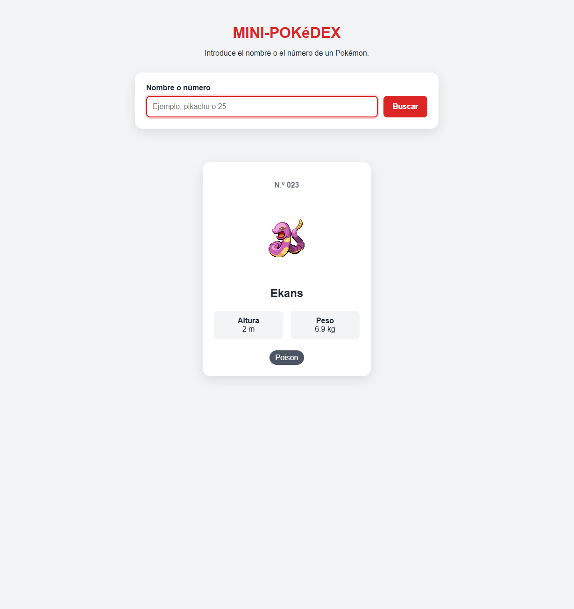
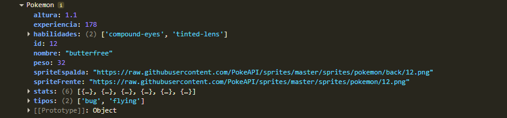

# Práctica Pokédex usando JavaScript
- **Autor:** Alejandro Donate García 2ºDAM
- **Asignatura:** Programación multimedia y dispositivos móviles

**Tecnologías:** HTML, CSS y JavaScript. Los datos son sacados de [PokéAPI](https://pokeapi.co/)

**¿Cómo se ejecuta?  Abrimos index.html y usamos la extension live server para verla en nuestro navegador.**

### Indice
1. [Punto de partida](#1-punto-de-partida)
2. [Carga de los 151 Pokémon](#2-carga-de-los-151-pokémon)

---

## 1. Punto de partida
La base que teniamos de la mini pokédex basicamentes nos permitía conectarnos a la API recogiendo unos cuantos parámetros que ofrecía la pagina como nombre, numero, peso, altura y tipo. 

### Estructura inicial
    
    mini-pokedex/
        ├── assets/
            ├── images/
            ├── readme/
                ├── 01-inicio.png
                ├── 01-busqueda-correcta.png
                ├── 01-error.png
        ├── index.html
        ├── css/
            ├── style.css
        ├── js/
            ├── app.js
            ├── Pokemon.js

### Funcionalidades que ya estaban implementadas

La busqueda usando la función `obtenerPokemon` accede a la API de forma correcta y obtiene el id, nombre, sprite, altura, peso y tipos del pokemon de manera correcta.
- Lo que hacemos es hacer un fetch de la url cargando los datos en una variable para luego convertirlos en formato JSON para poder leer los datos y cargarlos sobre variables con el respectivo nombre.

La creación del popup con la información del pokemon con `mostrarPokemon` funciona conrrectamente. 
- Aquí creamos una sección usando `innerHTML` para preparar donde veremos la informacion, todo esto sustituyendo la respuesta vacia por el nuevo HTML. 

Todas estas fucniones son ejecutadas al presionar el boton de buscar o presionar `Enter` con la función del formulario `addEventListener`
- Lo principal es escuchar al `event` que ocurre al pulsar el botón. Ahí usamos `await obtenerPokemon(busqueda)` para obtener los datos del pokemon y mostrarlos en el popup usando `mostrarPokemon`. 
- El `await` lo que hace es esperar a que la función `obtenerPokemon` termine de ejecutarse para luego continuar con la siguiente línea de código.

### Pruebas realizadas

| Prueba | Resultado |
| --- | --- |
|La página carga correctamente | ✅ |
|Búsqueda por nombre `pikachu` | ✅ |
|Búsqueda por número `25` | ✅ |
|Pokémon inexistentes | ✅ Muestra "Pokémon no encontrado"|
|Consola sin errores | ✅ Solo el aviso 404 del navegador al buscar un pokémon inexistentes.|

### Capturas

**Aplicación recien abierta**

**Búsqueda correcta**

**Pokémon inexistente**

### Commit del punto de partida
Este es el código de la practica guiada: [`6a00e51`](https://github.com/alejandroDonGar/Programacion-multimedia-y-dispositivos-moviles-2026---2027/commit/6a00e51093f555ad62d4826cbb21bc40bbf0680a)

---

## 2. Carga de los 151 Pokémon

### Cambios respecto al código incial
- **Nueva clase `Pokemon.js`** en js/. Antes el metodo de `obtenerPokemon` construia el objeto a mano y en su `return` pero ahora lo que se hace es que la clase `Pokemon.js` se trae los datos del fetch de la funcion a su propia clase para construir el objeto de manera independiente, controlando ella sola los parametros de este.
- **`obtenerPokemon`** ahora devuelve una instancia de la clase `Pokemon.js` en lugar de un objeto literal.
- **Nuevo boton `cargarPokemon`** para cargar todos los 151 pokémon usando la función `cargarPokemon`, funcionando en tandem con la función `obtenerPokemon` que va obteniendo los pokemon individualmente con cada click de busqueda.

### Consulta

Basicamente lo que hace la nueva funcion de `cargarPokemon` es hacer cargar una lista de los ids de los 151 pokemon, y esta transforma la variable de id de la funcion `obtenerPokemon` para que usando un for consigamos una lista de los 151 pokemon de una vez usando el ` await Promise.all`.

### Transformación de los datos

La API lo que hace es devolver muchisima información, cientos de campos. La clase Pokemon.js se encarga de manera independiente de unicamente recoger los datos que nos interesa.

| Propiedad | Datos de la API | Transformación |
| --- | --- | --- |
| `id` | `id` | - |
| `nombre` | `name` | - |
| `spriteFrente` / `spriteEspalda` | `sprite.front_default` / `sprite.back_default` | - |
| `altura` | `height` | + 10: de decímetros a metros |
| `peso` | `weight` | + 10: de hectogramos a kilogramos |
| `experiencia` | `base_experience` | - |
| `habilidades` | `abilities` | map -> solo el nombre de cada habilidad |
| `stats` | `stats` | map -> objeto `{nombre: stat, valor: base_stat}` |

**Esta sería la respuesta de la API en la consola usando unicmanete lo campos que seleccionamos en la clase Pokemon.**

### Estado de carga y error
- Al pulsar el botón de `cargarPokemon` aparece un mensaje de **"Cargando Pokémon..."** y el botón se desactiva para no volver a lanzar la operación más veces de las necesarias.
- Al terminar de cargar aparece un mensaje de **"151 Pokémon cargados"**.
- Si falla la conexión sale un mensaje de **"No se pudo conectar con la PokéAPI"** y el botón se vuelve a activar para intentarlo de nuevo.

**Cargando**

**Carga completa**

**Error de conexión simulando un estado de desconexión en el navegador**

