# Práctica Pokédex usando JavaScript
- **Autor:** Alejandro Donate García 2ºDAM
- **Asignatura:** Programación multimedia y dispositivos móviles

**Tecnologías:** HTML, CSS y JavaScript. Los datos son sacados de [PokéAPI](https://pokeapi.co/)

**¿Cómo se ejecuta?  Abrimos index.html y usamos la extension live server para verla en nuestro navegador.**

### Indice
1. [Punto de partida](#1-punto-de-partida)
2. [Carga de los 151 Pokémon](#2-carga-de-los-151-pokémon)
3. [Construcción de las tarjetas](#3-construcción-de-las-tarjetas)
4. [Barra de búsqueda y filtros](#4-barra-de-busqueda-y-filtros)
5. [Información ampliada](#5-información-ampliada)

---

## 1. Punto de partida
La base que teniamos de la mini pokédex basicamentes nos permitía conectarnos a la API recogiendo unos cuantos parámetros que ofrecía la pagina como nombre, numero, peso, altura y tipo. 

### Estructura inicial
    
    mini-pokedex/
        ├── assets/
            ├── images/
            ├── readme/
                ├── 01-inicio.png
                ├── 01-busqueda-correcta.png
                ├── 01-error.png
        ├── index.html
        ├── css/
            ├── style.css
        ├── js/
            ├── app.js
            ├── Pokemon.js

### Funcionalidades que ya estaban implementadas

La busqueda usando la función `obtenerPokemon` accede a la API de forma correcta y obtiene el id, nombre, sprite, altura, peso y tipos del pokemon de manera correcta.
- Lo que hacemos es hacer un fetch de la url cargando los datos en una variable para luego convertirlos en formato JSON para poder leer los datos y cargarlos sobre variables con el respectivo nombre.

La creación del popup con la información del pokemon con `mostrarPokemon` funciona conrrectamente. 
- Aquí creamos una sección usando `innerHTML` para preparar donde veremos la informacion, todo esto sustituyendo la respuesta vacia por el nuevo HTML. 

Todas estas fucniones son ejecutadas al presionar el boton de buscar o presionar `Enter` con la función del formulario `addEventListener`
- Lo principal es escuchar al `event` que ocurre al pulsar el botón. Ahí usamos `await obtenerPokemon(busqueda)` para obtener los datos del pokemon y mostrarlos en el popup usando `mostrarPokemon`. 
- El `await` lo que hace es esperar a que la función `obtenerPokemon` termine de ejecutarse para luego continuar con la siguiente línea de código.

### Pruebas realizadas

| Prueba | Resultado |
| --- | --- |
|La página carga correctamente | ✅ |
|Búsqueda por nombre `pikachu` | ✅ |
|Búsqueda por número `25` | ✅ |
|Pokémon inexistentes | ✅ Muestra "Pokémon no encontrado"|
|Consola sin errores | ✅ Solo el aviso 404 del navegador al buscar un pokémon inexistentes.|

### Capturas

**Aplicación recien abierta**

**Búsqueda correcta**

**Pokémon inexistente**

### Commit del punto de partida
- Este es el código de la practica guiada: [`6a00e51`](https://github.com/alejandroDonGar/Programacion-multimedia-y-dispositivos-moviles-2026---2027/commit/6a00e51093f555ad62d4826cbb21bc40bbf0680a)

---

## 2. Carga de los 151 Pokémon

### Cambios respecto al código incial
- **Nueva clase `Pokemon.js`** en js/. Antes el metodo de `obtenerPokemon` construia el objeto a mano y en su `return` pero ahora lo que se hace es que la clase `Pokemon.js` se trae los datos del fetch de la funcion a su propia clase para construir el objeto de manera independiente, controlando ella sola los parametros de este.
- **`obtenerPokemon`** ahora devuelve una instancia de la clase `Pokemon.js` en lugar de un objeto literal.
- **Nuevo boton `cargarPokemon`** para cargar todos los 151 pokémon usando la función `cargarPokemon`, funcionando en tandem con la función `obtenerPokemon` que va obteniendo los pokemon individualmente con cada click de busqueda.

### Consulta

Basicamente lo que hace la nueva funcion de `cargarPokemon` es hacer cargar una lista de los ids de los 151 pokemon, y esta transforma la variable de id de la funcion `obtenerPokemon` para que usando un for consigamos una lista de los 151 pokemon de una vez usando el ` await Promise.all`.

### Transformación de los datos

La API lo que hace es devolver muchisima información, cientos de campos. La clase Pokemon.js se encarga de manera independiente de unicamente recoger los datos que nos interesa.

| Propiedad | Datos de la API | Transformación |
| --- | --- | --- |
| `id` | `id` | - |
| `nombre` | `name` | - |
| `spriteFrente` / `spriteEspalda` | `sprite.front_default` / `sprite.back_default` | - |
| `altura` | `height` | `/` 10: de decímetros a metros |
| `peso` | `weight` | `/` 10: de hectogramos a kilogramos |
| `experiencia` | `base_experience` | - |
| `habilidades` | `abilities` | map -> solo el nombre de cada habilidad |
| `stats` | `stats` | map -> objeto `{nombre: stat, valor: base_stat}` |
| `tipos` | `types` | map -> solo el nombre de cada tipo |

**Esta sería la respuesta de la API en la consola usando unicmanete lo campos que seleccionamos en la clase Pokemon.**

### Estado de carga y error
- Al pulsar el botón de `cargarPokemon` aparece un mensaje de **"Cargando Pokémon..."** y el botón se desactiva para no volver a lanzar la operación más veces de las necesarias.
- Al terminar de cargar aparece un mensaje de **"151 Pokémon cargados"**.
- Si falla la conexión sale un mensaje de **"No se pudo conectar con la PokéAPI"** y el botón se vuelve a activar para intentarlo de nuevo.

**Cargando**

**Carga completa**

**Error de conexión simulando un estado de desconexión en el navegador**
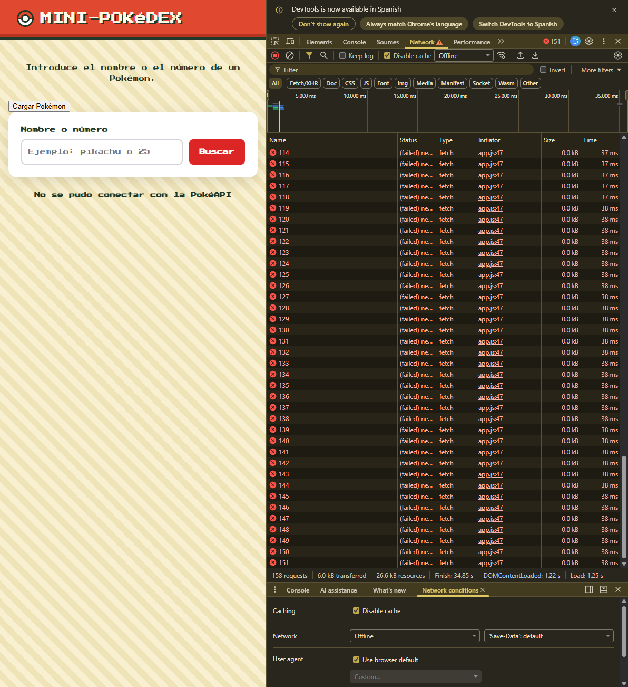

### Problemas encontrados

Durante la simulacion de la conexión fallida, el mensaje de **"151 Pokémon cargados"** seguía apareciendo. El problema era que seguía dentro de la misma sesión donde se estaba guardando el caché. Tuve que desactivar la opción de caché para que saliera el error.

### Commits de esta fase
- Clase `Pokemon.js`: [`c088507`](https://github.com/alejandroDonGar/Programacion-multimedia-y-dispositivos-moviles-2026---2027/commit/c088507)
- Más datos en la clase: [`9ca4da5`](https://github.com/alejandroDonGar/Programacion-multimedia-y-dispositivos-moviles-2026---2027/commit/9ca4da5)
- Carga de los 151 pokémon con Promise.all: [`171a3e9`](https://github.com/alejandroDonGar/Programacion-multimedia-y-dispositivos-moviles-2026---2027/commit/171a3e9)

---

## 3. Construcción de las tarjetas

### Datos que muestra cada tarjeta
Todos los datos recopilados salen del objeto Pokemon que cree en el apartado anterior.

| En la tarjeta | Propiedad |
| --- | --- |
| Número con formato `Nº001`| `id` con `formatearId`|
| Nombre en mayúsculas | `nombre` |
| Sprite de espaldas y de frente | `spriteEspalda` y `spriteFrente` |
| Tipos 1 o 2 | `tipos` |
| Altura y peso | `altura` m y `peso` kg |

### Generación dinámica de las tarjetas

Lo que hace el codigo es coger la informacion que ya estabamos generando en con el fetch, y lo traermos para generar un HTML con cada pokémon. Para que después salgan todas las tarjetas seguidas lo que hacemos es generar una lista que por cada objeto, vaya generando la tarjeta una tras otra y luego con un forEach hacemos que cada objeto individual detecte cuando el raton está sobre la tarjeta para darle la vuelta al sprite.

La cuadrícula se adapta sola al ancho de la pantalla usando un `grid` en el CSS

    grid-template-columns: repeat(auto-fill, minmax(180px, 1fr));

La linea lo que hace es decirle al `grid` que se repita la generacion de las tarjetas pero con un tamaño de 180px y con un maximo de espacio para generase de 1f o toda la pantalla. 

**Colección completa**
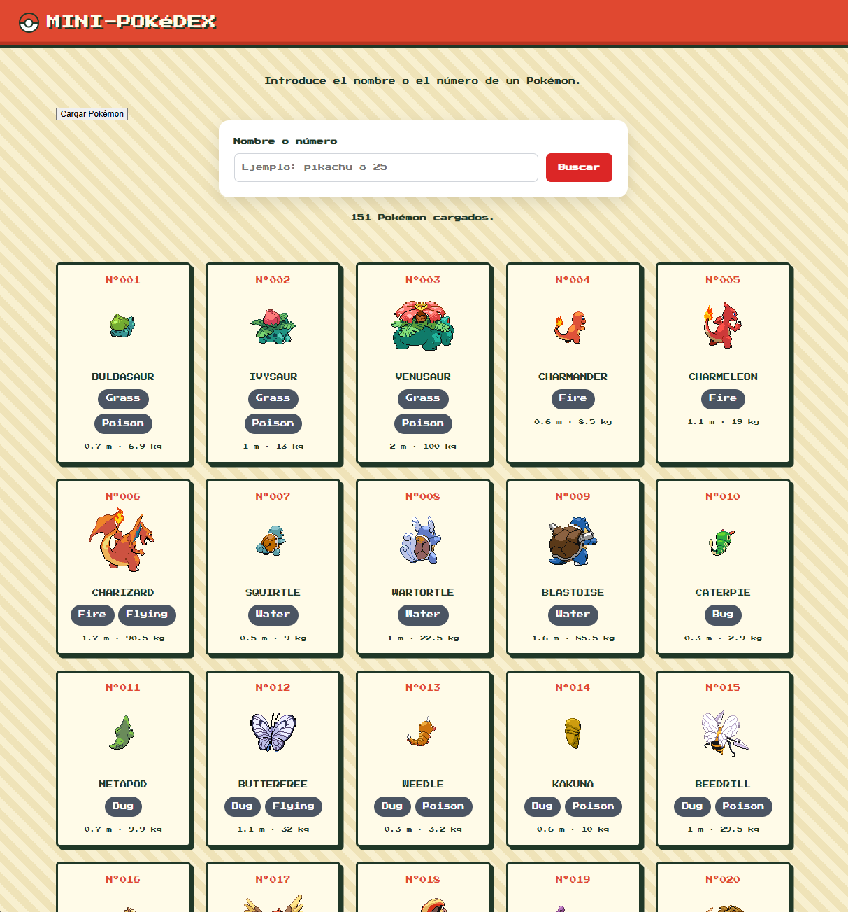

**Vista en móvil**
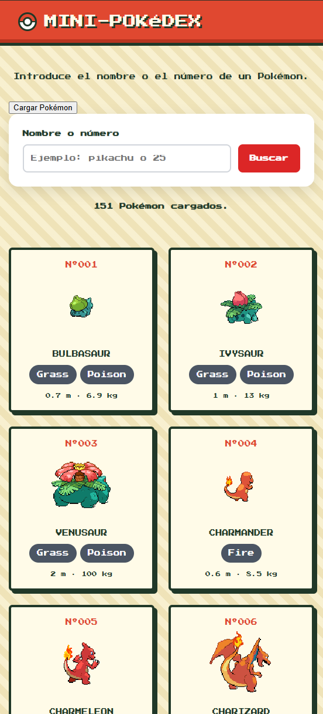

### Cambio entre sprite trasero y frontal

En la funcion de `cargarTarjeta` lo que hacemos es traernos del fetch la información de ambas imagenes. Luego lo que se hace es con una nueva funcion `activarCambioSrite` es detectar por cada tarjeta cuando el ratón del usuario está dentro del area de la tarjeta usando `tarjeta.addEventListener("mouseenter", () => { imagen.src = imagen.dataset.frente; })` y luego lo contrario para detectar cuando sale de esta con `tarjeta.addEventListener("mouseleave", () => { imagen.src = imagen.dataset.espalda; })`

**Sin el ratón o de espaldas**
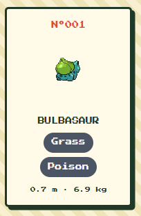

**Con el ratón o de frente**
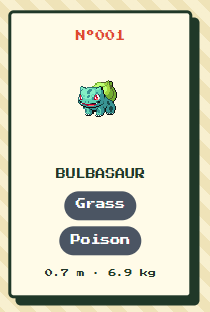

### Colores por tipo

La API tiene dos tipos de `tipo`. Por un lado tiene la categoria general donde almacena todos los tipos de los pokemon y por otro, dentro de esta tenemos los diferentes tipo de cada uno, `tipo--fire` o `tipo--water`.

Esto lo que se usa en el CSS para llamar a cada uno y darle un color unico. 

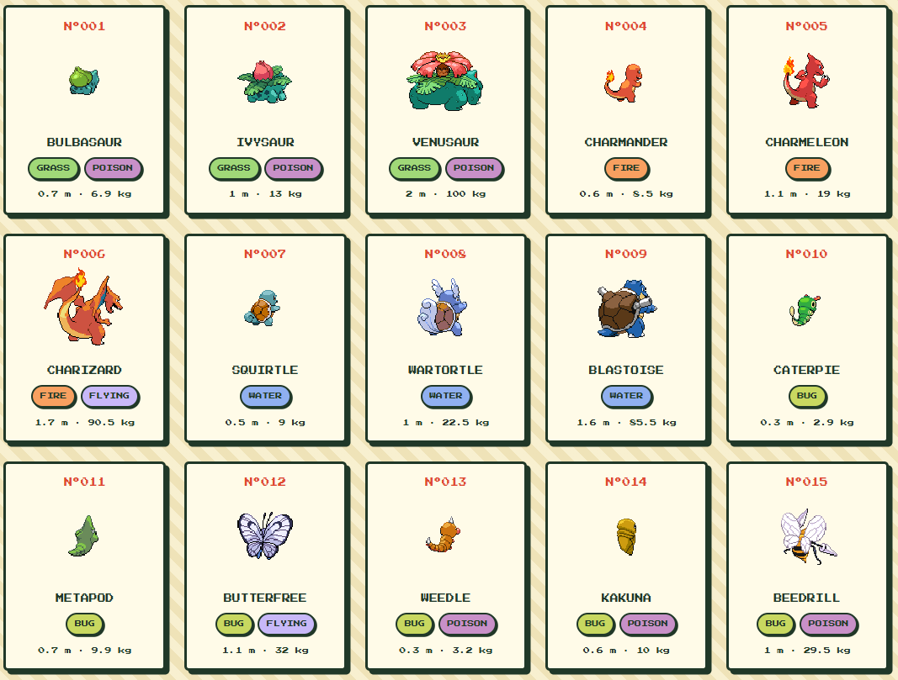

### Problemas encontrados y las soluciones

- **`contenedorTarjetas is not defined`** Lo que ocurrio aquí fue que al crear el metodo para la generación de las tarjetas se me olvido definir la variable global en el js por lo que no solo se rompió eso sino que tambien el error del catch del addEventListener saltaba.
- **Tarjetas a lo ancho y con el contenido en columnas** Lo que sucedio fue que el CSS de la cuadricula debía de ir dentro de su propio cubiculo `.tarjetas` pero por error lo metí dentro de `.tarjeta` haciendo que el grid se rompiera.
- **`tarjetas.forEach is not a function`** Al usario querySelector debemos de usar All también para que nos devuelva toodos las tarjetas en vez de solo una. La foma correcta final seria `querySelectorAll(".tarjeta")`.

### Commits de esta fase
- Funcion `crearTarjeta` y tarjeta de prueba: [`aab2bf5`](https://github.com/alejandroDonGar/Programacion-multimedia-y-dispositivos-moviles-2026---2027/commit/aab2bf5)
- Las 151 tarjetas en cuadrícula:[`c406cf7`](https://github.com/alejandroDonGar/Programacion-multimedia-y-dispositivos-moviles-2026---2027/commit/c406cf7)
- Cambio de sprite al pasar el ratón: [`10bea33`](https://github.com/alejandroDonGar/Programacion-multimedia-y-dispositivos-moviles-2026---2027/commit/10bea33)
- Colores por tipo:[`3fc10d2`](https://github.com/alejandroDonGar/Programacion-multimedia-y-dispositivos-moviles-2026---2027/commit/3fc10d2)

---

## 4. Barra de búsqueda y filtros

### Cambios respecto a la práctica guiada
Ahora el formularion ya no pide un Pokémon a la API sino que filtra las tarjetas que ya generamos al pulsar `Cargar Pokémon`. La funcion `mostrarPokemon` y la sección `#resultado` ya no se usan por lo que las borré. Tambien, `obtenerPokemon` se conserva porque la usa `cargarPokemon`.

### Búsqueda por texto
La funcion `filtrarPokemon` hace lo siguiente:
 - Normaliza el texto con `trim()` y `toLowerCase().
- Usa `filter` sobre `listaPokemon` y pasa el resultado a `mostrarTarjeta`.
- Busca por nombre o fragmento con `includes` y por número con `Number(texto) === pokemon.id`.
- Cuando el buscador está vacío vuelven los 151, porque `includes("")` siempre es `true`.
- Funciona al escribir (evento `input`) y al pulsar Buscar o Enter (evento `submit`).

### Filtro por tipo
`rellenarSelectorTipos` recorre los tipos de todos los Pokémon cargados, guarda cada uno una sola vez con `includes` y los ordena. No hay ningún tipo escrito a mano.

### Combinación de los dos filtros

    const coincideTexto = pokemon.nombre.includes(texto) || Number(texto) === pokemon.id;
    const coincideTipo = tipo === "todos" || pokemon.tipos.includes(tipo);
    return coincideTexto && coincideTipo;

Con el `return` coincideTexto && coincideTipo, solo se muestra el pokemon si cumple ambas condiciones.

### Casos de prueba

| Búsqueda | Resultado |
|---|---|
| `pikachu` | ✅ Solo Pikachu |
| `25` | ✅ Solo Pikachu |
| `char` | ✅ Charmander, Charmeleon y Charizard |
| Nombre inexistente | ✅ Mensaje "No hay ningún Pokémon..." y sin tarjetas |
| Buscador vacío | ✅ Vuelven los 151 |
| Tipo `fire` | ✅ Solo Pokémon de fuego |
| `char` + `fire` | ✅ Se cumplen los dos filtros |

**Búsqueda por nombre**

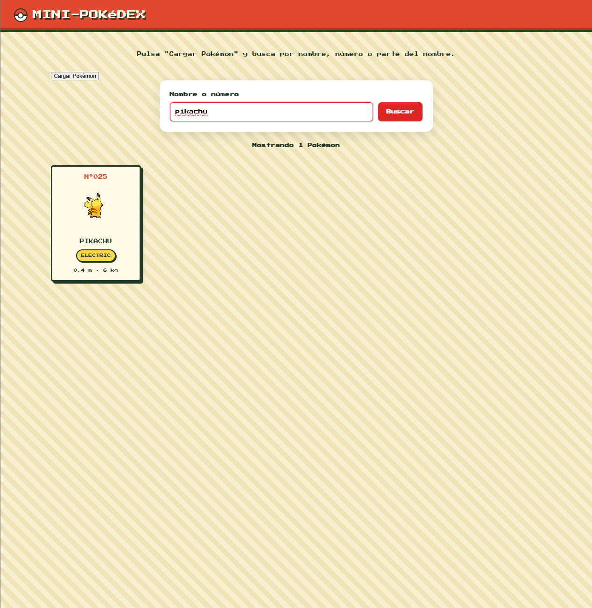

**Búsqueda por número**

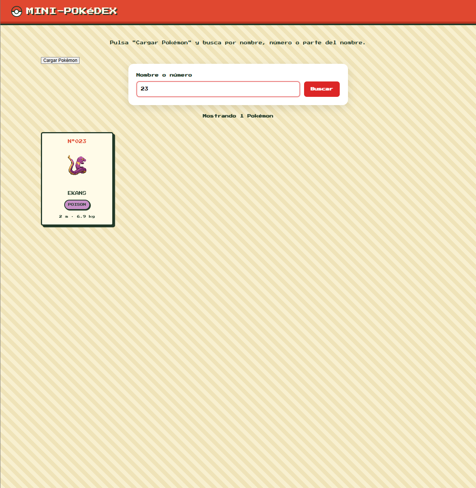

**Búsqueda por fragmento**

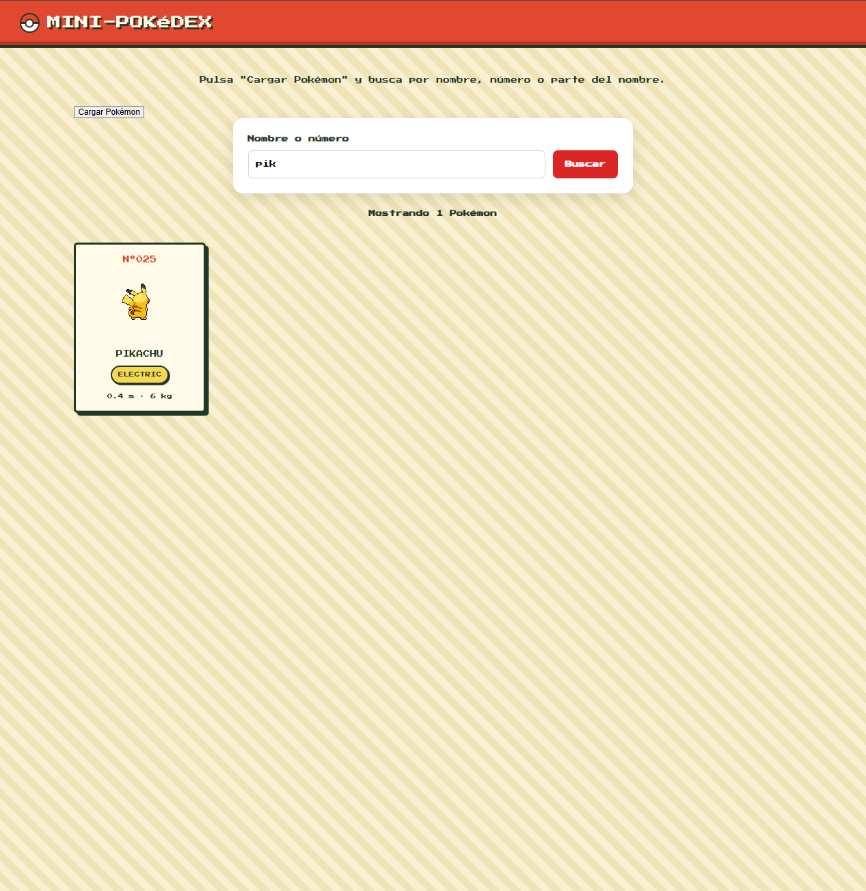

**Sin resultados**

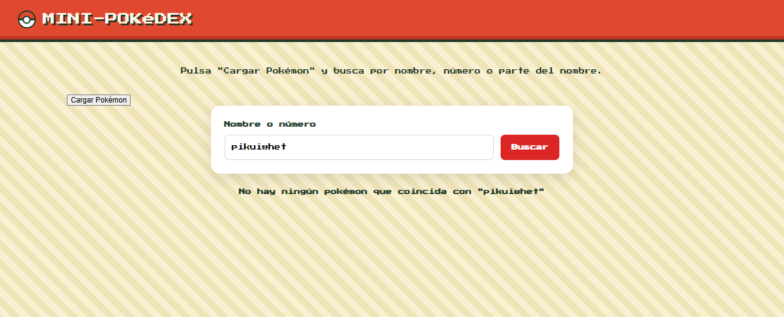

**Filtro por tipo**

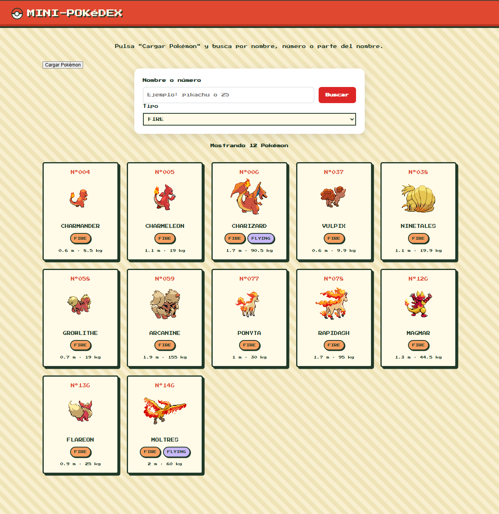

**Texto y tipo combinados**

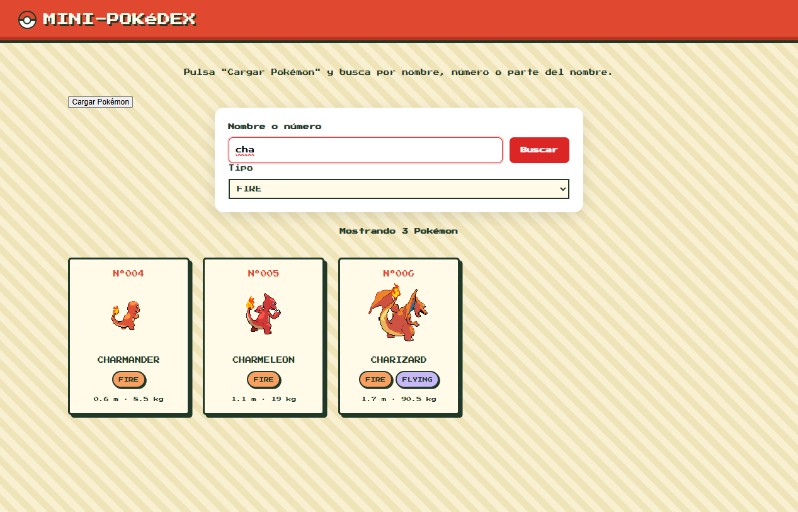

### Problemas encontrados y soluciones
- El filtrado en vivo solo funcionaba después de pulsar Buscar. Puse el evento `input` dentro del `submit`, así que solo se registraba al enviar y se volvía a añadir en cada búsqueda. Lo saqué fuera para registrarlo una sola vez.
- `Cannot access 'filtrarPokemon' before initialization`. Registraba el evento antes de la línea donde se crea la función con `const`. Moví los `addEventListener` al final del archivo.

### Commits de esta fase
Búsqueda por nombre, número y fragmento en tiempo real: [`af52ade`](https://github.com/alejandroDonGar/Programacion-multimedia-y-dispositivos-moviles-2026---2027/commit/af52ade) 
Selector de tipos combinado con la búsqueda: [`3771bff`](https://github.com/alejandroDonGar/Programacion-multimedia-y-dispositivos-moviles-2026---2027/commit/3771bff) 

---

## 5. Información ampliada

### Botón "Ver detalles" y panel
Así es como funciona:
- Cada tarjeta tiene un botón "Ver detalles" con el número del Pokémon guardado en `data-id`.
- Se abre con `showModal()`, se cierra con `close()` (botón X) o con la tecla Esc, y oscurece el fondo. Se cierra sin recargar la página.
- Un solo `addEventListener` en el contenedor de las tarjetas, `closest` para saber si se pulsó el botón y `find` para buscar el Pokémon en `listaPokemon`. Por qué así funciona también con las tarjetas filtradas.

### Datos adicionales
| Dato | Propiedad de la clase `Pokemon` |
|---|---|
| Imagen frontal grande | `spriteFrente` |
| Tipos | `tipos` (reutilizando `crearTiposHTML`) |
| Altura y peso | `altura` y `peso` |
| Experiencia base | `experiencia` |
| Habilidades | `habilidades` |
| Estadísticas base (PS, ataque, defensa, ataque especial, defensa especial, velocidad) | `stats`, con los nombres en español gracias a `nombresStats` |

El código de los tipos se repetía en la tarjeta y en el panel, así que lo saqué a `crearTiposHTML`.

**Panel abierto**

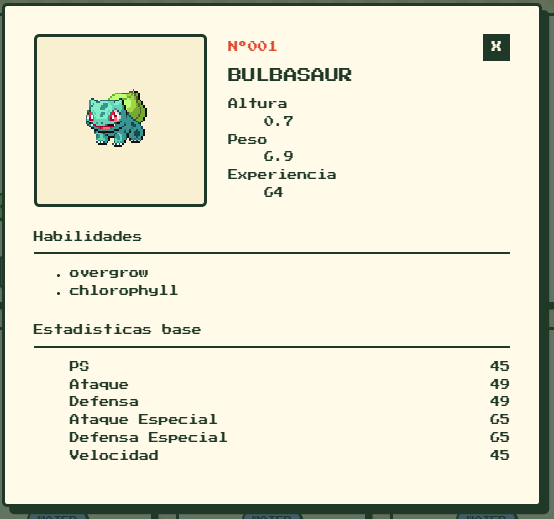

**Panel cerrado**

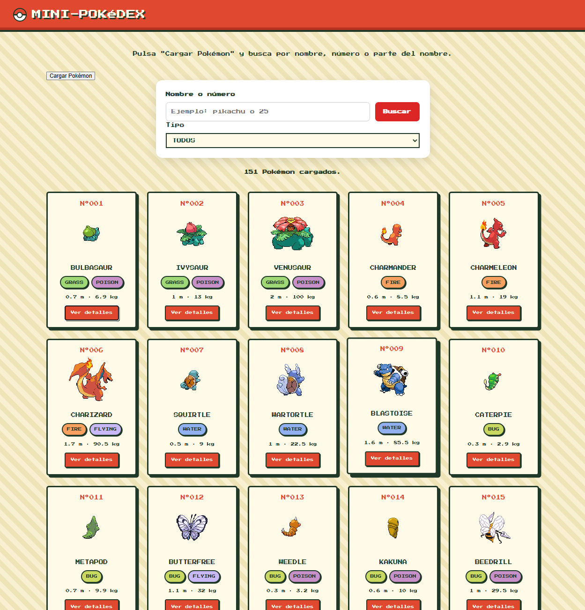

### Ampliación: barras de estadísticas
El ancho se calcula en porcentaje respecto a 200, con `Math.min` para que no pase del 100 %; los bloques se hacen con `repeating-linear-gradient`; se llenan a saltos con una animación con `steps(10)`; y se desactivan si el usuario tiene activado reducir movimiento.

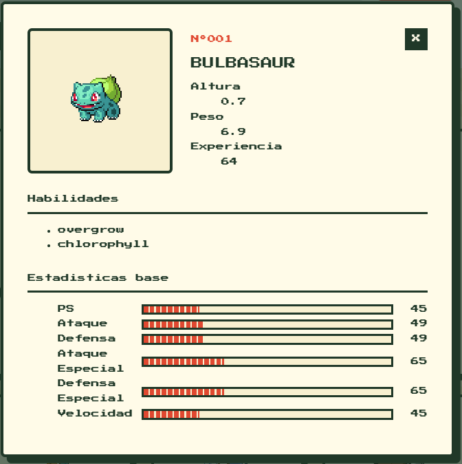

### Problemas encontrados y soluciones
- **La X de cerrar salía sin estilo:** [la clase del HTML (`cerrar-panel`) no coincidía con la del CSS (`panel__cerrar`).]
- **Las barras no se veían:** [escribí `stat_barra` con un guion bajo en vez de `stat__barra`. El hueco se quedaba sin estilo y sin altura, y el relleno, con `height: 100%`, también medía 0. Lo descubrí con Inspeccionar elemento.]

### Commits de esta fase
Botón Ver detalles y panel con `<dialog>`: [`aaf7697`](https://github.com/alejandroDonGar/Programacion-multimedia-y-dispositivos-moviles-2026---2027/commit/aaf7697) 
Panel con toda la información: [`8e23f74`](https://github.com/alejandroDonGar/Programacion-multimedia-y-dispositivos-moviles-2026---2027/commit/8e23f74) 
Barras de estadísticas: [`XXXXXXX`](https://github.com/alejandroDonGar/Programacion-multimedia-y-dispositivos-moviles-2026---2027/commit/XXXXXXX) 